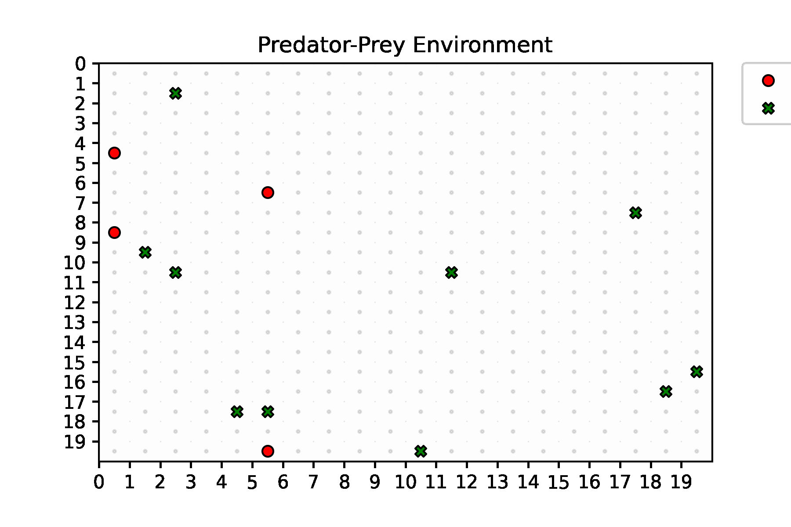

# Predator-Prey Variations

This is the collection of environments inspired from the classic multi-agent Predator-Prey reinforcement learning environment. Each environment supports multiple agents and serve as a platform to test decentralized and centralized multi-agent algorithms. The environments are built to include features such as environment and 



## Variations.

1. Classic Predator-Prey.
2. Communicative Predator-Prey.
3. Potential-Reward Predator-Prey.
4. Hunter-Scout Predator-Prey.

Each variation can also be initialized with a set of modules with give the ability to change how rewards are distributed, the order in which teams take actions, toggle complete and partial observability, control hit points and add actions. 

The goal is to allow researchers to build more robust and complex multi-agent algorithms on the same underlying platform. Emphasis is also placed on highly distributed training of agents. 

## Algorithms.

The repository also contains a collection of implemented decentralized and centralized implementations of multi-agent algorithms. Most implementations are written in both in PyTorch and Tensorflow with self-contained networks and training functions such that hierarchical planning with implicit (via reward) or explicit (via messages) communication between the agents can be achieved. 

1. Independent Advantage Actor-Critic (A2C).
2. Independent Soft Actor-Critic with off-policy training.
3. Independent Double-Duelling DQNs with prioritized replay buffer.
4. Centralized Actor-Critc Network. 

## Getting Started. 

Clone Repo

Linux : Simply clone the repo, create a virtual env to install the dependencies and enjoy!

```
pip install [requirements txt](requirements.txt)
```

 ## Training.

Agent policies are trainers using trainer programs. Three modes for training are provided:
 1. *train_\** - Training single or multiple hetrogenoues policies (predator or prey).
 2. *train_prey_\** - Training single or multiple predator policies while keeping the prey policies static. 
 [3](3). *train_prey_\** - Training single or multiple prey policies while keeping the predator policies static. 

`python train_pred.py` : Trains and saves the best policies.

New trainers must be derived from the  basecalss *Trainer*. See the [trainers]() folder for a more detailed description for configuring training paramters.

## Evaluation and Inference. 

## Phase Portraits.

## License
